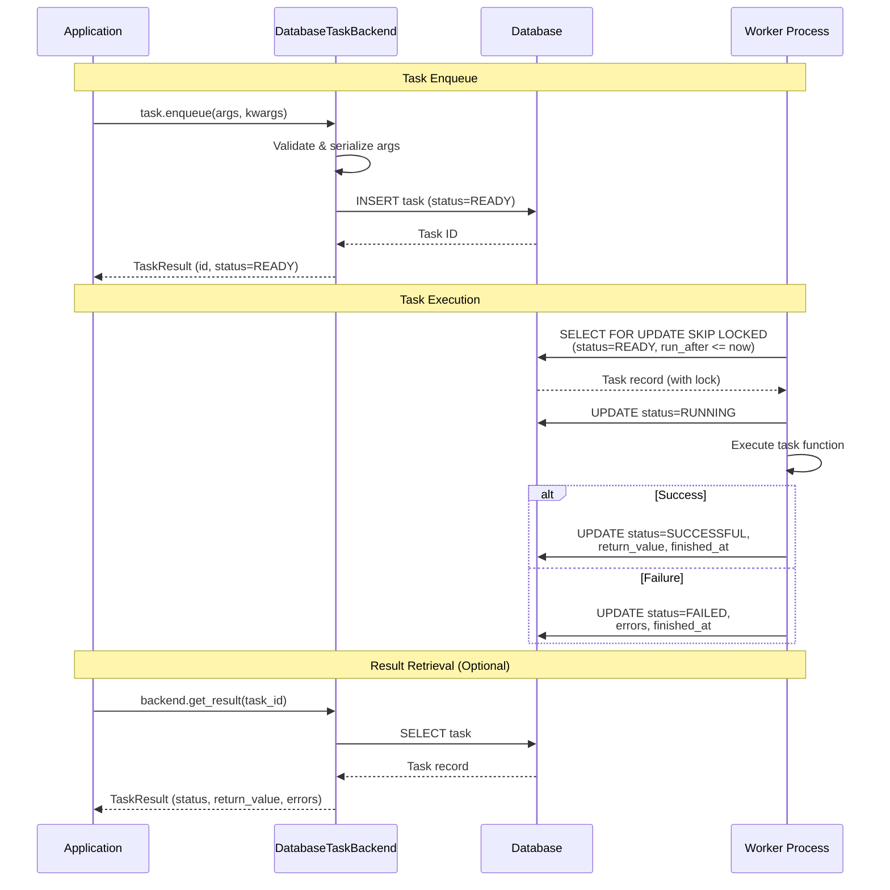
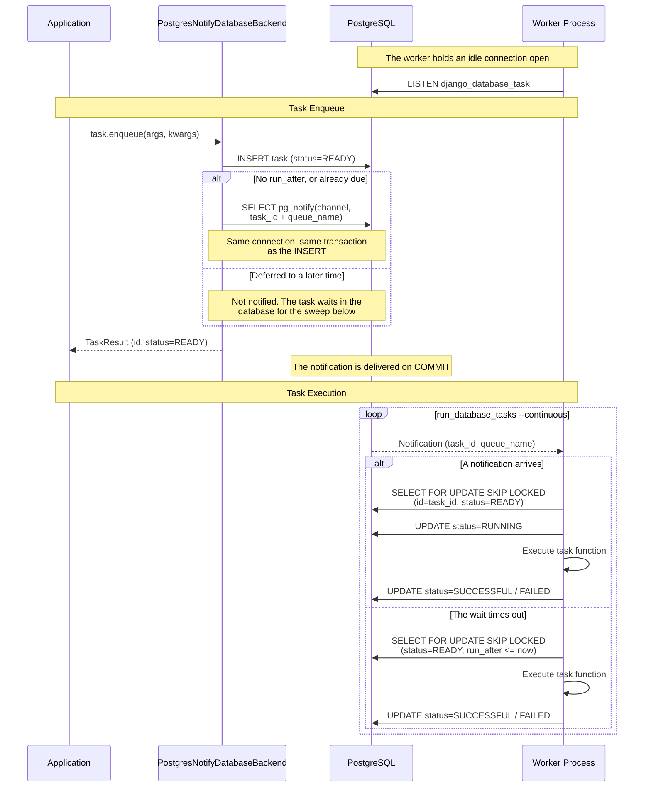
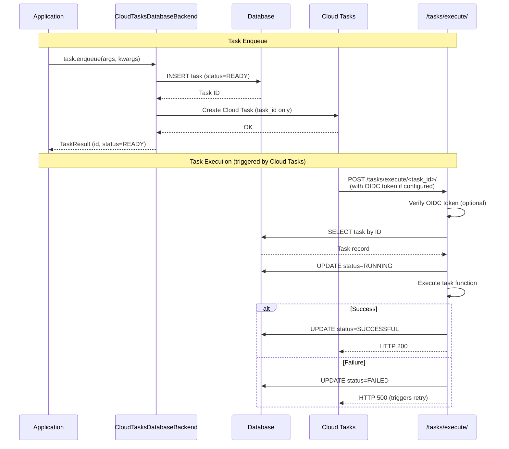
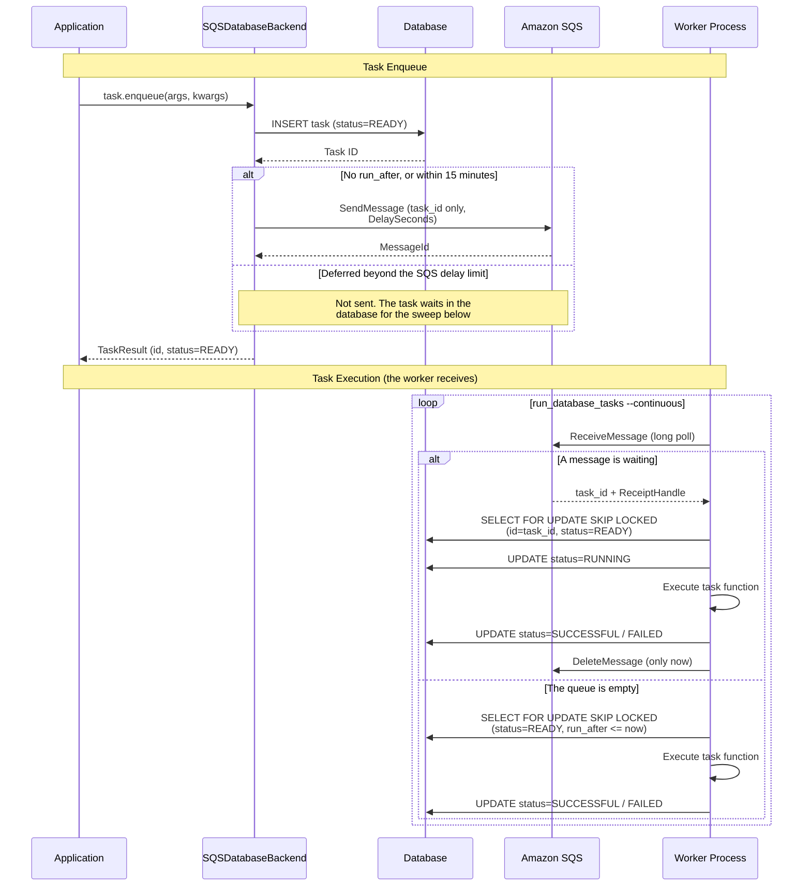

# django-database-task

[](https://github.com/tokibito/django-database-task/actions/workflows/ci.yml)
[](https://badge.fury.io/py/django-database-task)
[](https://pypi.org/project/django-database-task/)
[](https://opensource.org/licenses/MIT)

A database-backed task queue backend for Django's built-in task framework.

## Features

- **No external dependencies** - Uses your existing database, no Redis or message broker required
- **Priority support** - Tasks can have priorities from -100 to 100
- **Delayed execution** - Schedule tasks to run at a specific time with `run_after`
- **Exclusive locking** - Prevents duplicate task execution with `SELECT FOR UPDATE SKIP LOCKED`
- **Django Admin integration** - View and manage tasks from the admin interface
- **Async support** - Supports async task functions
- **Graceful shutdown** - Workers finish the running task before exiting on `SIGTERM`
- **Crash recovery** - Tasks stranded in `RUNNING` by a killed worker are found and requeued
- **Job scheduler friendly** - Opt-in exit codes that tell an idle run from a failed one, plus structured log fields for JP1 / Hinemos / cron / systemd timers
- **Instant pickup on PostgreSQL** - Optional `LISTEN`/`NOTIFY` broker that wakes the worker the moment a task is saved, with no extra service to run
- **Google Cloud Tasks integration** - Optional backend for GAE/Cloud Run with auto-detection

## Architecture



## Requirements

- Python 3.12+
- Django 6.0+

### Supported Databases

The minimum database versions are the ones Django itself requires, and Django
6.1 raised most of them:

| Database | Django 6.0 | Django 6.1 | Notes |
|----------|------------|------------|-------|
| PostgreSQL | 14+ | 15+ | Recommended for production. Full `SELECT FOR UPDATE SKIP LOCKED` support. |
| MySQL | 8.0.11+ | 8.4+ | Full `SELECT FOR UPDATE SKIP LOCKED` support. |
| MariaDB | 10.6+ | 10.11+ | Full `SELECT FOR UPDATE SKIP LOCKED` support. |
| SQLite | 3.31.0+ | 3.37.0+ | Works for development/testing, but no row-level locking. |
| Oracle | 19c+ | 19c+ | Supported but not tested with this package. |

**Note**: `SELECT FOR UPDATE SKIP LOCKED` is used to prevent duplicate task execution in multi-worker environments. SQLite does not support row-level locking, so it is only recommended for development or single-worker deployments.

## Installation

```bash
pip install django-database-task

# With a broker (see Task Brokers)
pip install django-database-task[cloudtasks]
pip install django-database-task[sqs]

# The PostgreSQL broker needs no extra: it uses the driver you already have
```

## Quick Start

### 1. Add to INSTALLED_APPS

```python
INSTALLED_APPS = [
    # ...
    'django_database_task',
]
```

### 2. Configure the task backend

```python
TASKS = {
    'default': {
        'BACKEND': 'django_database_task.backends.DatabaseTaskBackend',
        'QUEUES': [],  # Empty list means all queues
        'OPTIONS': {},
    },
}
```

### 3. Run migrations

```bash
python manage.py migrate django_database_task
```

### 4. Define a task

```python
from django.tasks import task

@task
def send_welcome_email(user_id):
    user = User.objects.get(id=user_id)
    # Send email...
    return f"Email sent to {user.email}"
```

### 5. Enqueue the task

```python
result = send_welcome_email.enqueue(user_id=123)
print(f"Task ID: {result.id}")
```

### 6. Run the worker

```bash
# Run once (exit when no tasks)
python manage.py run_database_tasks

# Run continuously (poll every 5 seconds)
python manage.py run_database_tasks --continuous --interval 5
```

## Usage

### Important: JSON-Serializable Parameters

Task arguments, keyword arguments, and return values **must be JSON-serializable**.

Supported types:
- `str`, `int`, `float`, `bool`, `None`
- `dict` (with JSON-serializable keys and values)
- `list`, `tuple` (with JSON-serializable elements)
- `bytes` (UTF-8 decodable only)

**Not supported** (will raise `TypeError`):
- `datetime`, `date`, `time` - convert to ISO string: `dt.isoformat()`
- `UUID` - convert to string: `str(uuid)`
- `Decimal` - convert to float or string
- Custom objects - serialize manually

```python
from django.tasks import task

# ❌ This will raise TypeError
@task
def bad_task(user_id, created_at):
    pass
bad_task.enqueue(123, datetime.now())  # TypeError!

# ✅ Convert to JSON-serializable types
@task
def good_task(user_id, created_at_iso):
    created_at = datetime.fromisoformat(created_at_iso)
    # ...
good_task.enqueue(123, datetime.now().isoformat())  # OK
```

### Task with priority

```python
@task(priority=10)  # Higher priority, runs first
def urgent_task():
    pass

@task(priority=-10)  # Lower priority
def background_task():
    pass
```

### Delayed execution

```python
from datetime import timedelta
from django.utils import timezone

# Run 1 hour from now
delayed_task = my_task.using(run_after=timezone.now() + timedelta(hours=1))
result = delayed_task.enqueue()
```

### Task with context

```python
@task(takes_context=True)
def task_with_context(context, message):
    task_id = context.task_result.id
    attempt = context.attempt
    return f"Task {task_id} (attempt {attempt}): {message}"
```

### Async tasks

```python
@task
async def fetch_data(url):
    async with aiohttp.ClientSession() as session:
        async with session.get(url) as response:
            return await response.text()

# Enqueue like normal tasks
result = fetch_data.enqueue("https://example.com/api")
```

### Queue-specific tasks

```python
@task(queue_name="emails")
def send_newsletter():
    pass

# Run worker for specific queue
# python manage.py run_database_tasks --queue emails
```

## Management Commands

### run_database_tasks

Execute tasks queued in the database.

```bash
python manage.py run_database_tasks [options]
```

| Option | Description |
|--------|-------------|
| `--queue` | Queue name to process (all queues if not specified) |
| `--backend` | Backend name (default: "default") |
| `--continuous` | Keep polling even when no tasks |
| `--interval` | Polling interval in seconds (default: 5) |
| `--max-tasks` | Maximum number of tasks to process (0=unlimited) |
| `--source` | Where to look for tasks: `auto` (default), `db`, `broker` or `both`. See [Task sources](#task-sources) |
| `--wait-time` | Seconds to wait for a broker message before looking again (default: 20) |
| `--max-messages` | Maximum number of broker messages to receive at a time (default: 1) |
| `--shutdown-timeout` | Maximum seconds to wait for the running task after `SIGTERM`/`SIGINT` before forcing exit (0=wait indefinitely, default: 0) |
| `--no-graceful-shutdown` | Do not install signal handlers (terminate immediately, even while a task is running) |
| `--empty-exit-code` | Exit with this code when no task was processed (0=exit normally, default: 0) |
| `--failed-exit-code` | Exit with this code when at least one task failed (0=exit normally, default: 0) |
| `--verbosity` | Output level: `0` silent (errors only), `1` normal (default), `2` also print an idle heartbeat dot per poll |

See [Graceful Shutdown](#graceful-shutdown) for details, and
[Running from a job scheduler](#running-from-a-job-scheduler) for the exit
code options.

#### Task sources

By default the worker polls the database, which is what it has always done.
When the backend has a [broker](#task-brokers) a worker can receive from — a
`PullBroker` — the same command also receives from it, without any change to
how the command is run.

| `--source` | Behaviour |
|------------|-----------|
| `auto` | `both` when the backend has a `PullBroker`, `db` otherwise. The default |
| `db` | Poll the database only. What the command did before 0.4 |
| `broker` | Receive from the broker only |
| `both` | Receive from the broker, and fall back to the database when it is empty |

`both` is the useful combination for a broker that cannot hold a task
indefinitely. A broker with a delivery delay limit — SQS caps it at 15 minutes
— cannot carry a task deferred further out than that, so those stay in the
database until they are due, and the database sweep is what picks them up. It
is also what recovers tasks the broker never accepted, since a broker failure
during `notify()` is logged and swallowed.

While receiving from a broker, `--wait-time` replaces `--interval` as the idle
wait: the broker's own wait for a message is the pause, so a message wakes the
worker as soon as it arrives. `SIGTERM` is still honoured — see
[Graceful Shutdown](#graceful-shutdown).

A message is acknowledged whenever redelivering it would not help: the task
ran (whether it succeeded or failed), it no longer exists, or another worker
already holds it. If the worker itself cannot run the task, the message is
returned to the broker instead, to be delivered again. A broker that cannot
redeliver — [PostgreSQL LISTEN/NOTIFY](#postgresql-listennotify-integration)
has no such thing — does nothing in either case, and leans on the database
sweep instead.

#### Output verbosity

At the default verbosity the worker only prints the startup banner and one
block per task, so its output stays readable in a log aggregator. Idle polls in
`--continuous` mode print nothing.

Pass `-v 2` to print a `.` for every poll that found no task - useful when
watching a worker interactively to confirm it is alive, but it buries real log
output if left on in production.

Pass `-v 0` to suppress the informational output entirely; task failures and
errors are still reported.

### purge_completed_database_tasks

Delete completed task records from the database.

```bash
python manage.py purge_completed_database_tasks [options]
```

| Option | Description |
|--------|-------------|
| `--days` | Delete tasks completed more than N days ago (0=all) |
| `--status` | Target statuses, comma-separated (default: "SUCCESSFUL,FAILED") |
| `--batch-size` | Number of tasks to delete at once (default: 1000) |
| `--dry-run` | Show count only without deleting |

### requeue_stale_database_tasks

Recover tasks left in `RUNNING` status by a worker that was killed before it
could write a result. See
[Recovering tasks left in RUNNING status](#recovering-tasks-left-in-running-status)
for what this does to a task and when it is safe.

```bash
python manage.py requeue_stale_database_tasks --older-than 1h [options]
```

| Option | Description |
|--------|-------------|
| `--older-than` | **Required.** Only touch tasks that have been `RUNNING` for longer than this: `90s`, `15m`, `2h`, `1d`. The unit is required |
| `--queue` | Queue name to recover (all queues if not specified) |
| `--backend` | Backend name to recover (all backends if not specified) |
| `--max-attempts` | Mark a task `FAILED` instead of requeueing it once it has been handed to this many workers (0=no limit, default: 3) |
| `--mark-failed` | Mark every stale task `FAILED` instead of requeueing it |
| `--notify-broker` | Tell the backend's broker about each requeued task |
| `--batch-size` | Number of tasks to process at once (default: 1000) |
| `--dry-run` | Show what would happen without changing anything |

## Graceful Shutdown

When a worker is redeployed, the orchestrator (Kubernetes, Cloud Run, systemd,
Docker, supervisord, ...) sends `SIGTERM` and kills the process with `SIGKILL`
after a grace period. Without any handling, a task that happens to be running
at that moment is killed halfway through and stays in `RUNNING` status forever.

`run_database_tasks` installs `SIGTERM` and `SIGINT` handlers by default:

1. On the first signal the worker stops fetching new tasks.
2. The task currently being executed keeps running until it finishes and its
   result is written to the database.
3. The worker then exits with status code 0.

While no task is running (the polling sleep in `--continuous` mode), the signal
is handled immediately - the worker does not wait out the remaining interval.

```console
$ python manage.py run_database_tasks --continuous
Worker ID: worker-1-3f2a9c11
Backend: default
Continuous mode: interval=5.0s
Graceful shutdown: enabled (timeout=unlimited)

Processing task: 1e2d... (myapp.tasks.send_report)
^C
Received SIGINT: no new tasks will be started. Waiting for the running task to finish (send the signal again to force exit).
  Task completed successfully

Shutdown complete (no task was interrupted).

Total tasks processed: 1
```

### Shutdown timeout

By default the worker waits as long as the running task needs. Use
`--shutdown-timeout` to put an upper bound on it, so the process exits on its
own terms instead of being `SIGKILL`ed by the platform:

```bash
python manage.py run_database_tasks --continuous --shutdown-timeout 25
```

If the task is still running when the timeout expires, the process exits
immediately with status code 1 and the task stays in `RUNNING` status.
Set this to a value slightly below the platform's termination grace period,
and keep the grace period longer than your longest task whenever possible.

Sending the signal a second time (for example pressing Ctrl-C twice) also
forces an immediate exit.

### Cooperating from inside a task

Long running tasks can check whether a shutdown was requested and stop early,
so the worker does not have to wait for the whole task to complete:

```python
from django.tasks import task

from django_database_task import is_shutdown_requested


@task
def import_rows(row_ids):
    processed = []
    for row_id in row_ids:
        if is_shutdown_requested():
            # Requeue the remaining work and return early
            import_rows.enqueue([i for i in row_ids if i not in processed])
            break
        handle(row_id)
        processed.append(row_id)
    return len(processed)
```

`is_shutdown_requested()` returns `False` when no worker with graceful shutdown
is active, so tasks using it stay safe to call from a web request, a test, or
the HTTP endpoints.

### Deployment examples

**Kubernetes** - set `terminationGracePeriodSeconds` longer than the worker's
shutdown timeout:

```yaml
spec:
  terminationGracePeriodSeconds: 60
  containers:
    - name: worker
      command:
        - python
        - manage.py
        - run_database_tasks
        - --continuous
        - --shutdown-timeout=50
```

**systemd** - `TimeoutStopSec` controls how long systemd waits before
`SIGKILL`:

```ini
[Service]
ExecStart=/srv/app/venv/bin/python manage.py run_database_tasks --continuous --shutdown-timeout=50
KillSignal=SIGTERM
TimeoutStopSec=60
Restart=always
```

**Docker / Docker Compose** - `docker stop` sends `SIGTERM` and waits for
`--time` (10 seconds by default):

```yaml
services:
  worker:
    command: python manage.py run_database_tasks --continuous --shutdown-timeout=25
    stop_grace_period: 30s
```

Make sure the worker is PID 1 or that the signal reaches it (use the exec form
of `CMD`, or an init such as `tini`, rather than wrapping the command in a
shell script that swallows signals).

### Recovering tasks left in RUNNING status

If a worker is killed with `SIGKILL` (grace period exceeded, OOM killer, node
failure, `--no-graceful-shutdown`), the task it was running stays in `RUNNING`
status because no process is left to update it. Such tasks are not picked up
again by other workers, so without recovery they sit there forever.

`requeue_stale_database_tasks` finds them and puts them back in `READY`:

```bash
python manage.py requeue_stale_database_tasks --older-than 1h
```

```console
Stale after: 1h
Mode: requeue (max attempts: 3)
Found 2 stale tasks
Requeued 2 tasks, marked 0 as failed
```

Run it from cron or a systemd timer, next to your purge job. It is a separate
command on purpose: recovering on worker startup would let a machine with a
skewed clock take a task another worker is still running.

```cron
*/5 * * * * cd /srv/app && python manage.py requeue_stale_database_tasks --older-than 1h
0 4 * * *   cd /srv/app && python manage.py purge_completed_database_tasks --days 7
```

#### Choosing --older-than

**Keep the threshold comfortably above your longest running task.** Nothing
distinguishes "the worker died" from "the task is slow" - both look like a row
that has been `RUNNING` for a while. A task still running when its threshold
passes is requeued and ends up running twice, on two workers at once.

The option is required and has no default for that reason. If your longest task
takes 20 minutes, `--older-than 1h` is a reasonable choice; `--older-than 15m`
is not.

#### What recovery does to a task

| | Requeued (`READY`) | Given up on (`FAILED`) |
|---|---|---|
| `status` | `READY` | `FAILED` |
| `started_at` | cleared | kept |
| `finished_at` | cleared | set to now, so `purge --days` can see it |
| `return_value_json` | cleared | kept |
| `errors_json` | kept | a `WorkerLost` entry is added |
| `worker_ids_json` | kept - this is the attempt count | kept |

A task is given up on rather than requeued when it has already been handed to
`--max-attempts` workers (default 3), or when `--mark-failed` is used.

`--max-attempts` is there for tasks that kill the worker themselves - one that
exhausts the machine's memory would otherwise be requeued forever, killing one
worker after another. Once it trips, the task stops moving and a person can
look at it. Note that a `FAILED` task is in the default target of
`purge_completed_database_tasks`, so it disappears on the next purge; narrow
`--status` or widen `--days` if you need time to investigate.

#### Non-idempotent tasks

Requeueing runs the task **again from the beginning**. Whatever the killed
attempt already did is not undone: mail that was sent stays sent, an external
API call stays made, a charge stays charged. Recovery is only safe for tasks
that can run twice.

A task is safe if its writes are idempotent - `get_or_create` or an upsert
rather than a blind `create`, an idempotency key on outbound API calls, a
"done" marker checked at the top. If a half-finished run leaves something
inconsistent, it is not safe.

If some of your tasks are not idempotent, pick one of these:

**Make the task idempotent** (best, when you can). Pass an idempotency key to
external services, record what has already been done, and check it on entry.

**Split the queues** and treat them differently. Send tasks that cannot be
repeated to their own queue, and run recovery twice with different options:

```cron
# Safe to run twice: put them back in the queue, one job per queue.
*/5 * * * * cd /srv/app && python manage.py requeue_stale_database_tasks --older-than 1h --queue default
*/5 * * * * cd /srv/app && python manage.py requeue_stale_database_tasks --older-than 1h --queue emails
# Not safe: record them as failed and leave them to a person.
*/5 * * * * cd /srv/app && python manage.py requeue_stale_database_tasks --older-than 1h --queue payments --mark-failed
```

Name every safe queue explicitly rather than running one job without `--queue`:
without it the command covers *every* queue, the unsafe one included, and it
would requeue the tasks you meant to hold back.

**Mark everything failed** and requeue by hand. Run recovery with
`--mark-failed` everywhere, then use the "Requeue tasks stuck in running"
action in the Django admin (or "Retry failed tasks") on the ones you decide are
safe. The admin action does not run the task itself - it puts it back in
`READY` for a worker to pick up.

#### Workers that only receive from a broker

Requeueing a task puts it back in the database, but the broker message for the
killed attempt is already gone. A worker running with `--source broker` never
sees the task again. Add `--notify-broker` so the broker is told about each
requeued task:

```bash
python manage.py requeue_stale_database_tasks --older-than 1h --notify-broker
```

This is off by default; with `--source db` or `--source both` the worker finds
the task by polling and no message is needed.

### Using it in your own worker loop

The shutdown handling is available as a public API, for custom worker loops:

```python
from django_database_task import GracefulShutdown, process_tasks

with GracefulShutdown(timeout=50) as shutdown:
    while not shutdown.is_set():
        results = process_tasks(max_tasks=10, stop_event=shutdown)
        if not results and shutdown.wait(5):  # interruptible sleep
            break
```

| API | Description |
|-----|-------------|
| `GracefulShutdown(signals=None, timeout=0, on_signal=None, force_on_repeat=True)` | Context manager that installs the signal handlers |
| `shutdown.is_set()` | True once a shutdown has been requested |
| `shutdown.wait(seconds)` | Sleep, returning early (True) when a shutdown is requested |
| `shutdown.set()` | Request a shutdown programmatically |
| `process_tasks(..., stop_event=...)` | Stop starting new tasks once the event is set |
| `is_shutdown_requested()` | True if the active worker was asked to shut down |

## Running from a job scheduler

An on-premise scheduler — JP1, Hinemos, Rundeck, cron, a systemd timer — starts
`run_database_tasks` on its own schedule, waits for it to exit, and decides
what happened from the exit code. That is a different shape from a long-running
worker, and three things make it work: exit codes the scheduler can act on, a
lock so a slow run is not overlapped by the next one, and logs that survive
being scraped.

No broker is involved. The scheduler is the trigger, and the database is the
queue.

### Exit codes

By default the command exits 0 whether it ran a hundred tasks, none at all, or
one that failed — the same as before these options existed. Both options below
are opt-in, so adding them cannot break an existing `cron` line or Kubernetes
`Job`.

| Option | Meaning |
|--------|---------|
| `--empty-exit-code CODE` | Exit with `CODE` when no task was processed |
| `--failed-exit-code CODE` | Exit with `CODE` when at least one task failed or could not be run |

```bash
python manage.py run_database_tasks --empty-exit-code=4 --failed-exit-code=1
```

With that line a scheduler sees:

| Exit code | What happened |
|-----------|---------------|
| `0` | At least one task ran and every one of them succeeded |
| `1` | At least one task failed, or the worker could not run it at all |
| `4` | There was nothing to do |
| `1` (without the options) | The command itself could not start — bad `--backend`, `--source` the backend cannot serve, unreadable settings |

Pick the codes to suit the scheduler. JP1 compares the code against a warning
threshold per job, so an idle run is usually mapped to a warning code above the
normal end code and below the abnormal one; `--empty-exit-code=4` with a
warning threshold of 4 and an error threshold of 8 is a common arrangement.

Both codes must be between 0 and 255 — anything larger is truncated by the
operating system before the scheduler ever sees it, so the command rejects it
up front rather than reporting a code you did not choose.

A failure outranks an idle run. A task the worker could not run at all leaves
the processed count at zero while still being a failure, so both conditions can
hold at once, and `--failed-exit-code` wins.

What counts as a failure:

- a task that ran and ended `FAILED`
- a task the worker could not run at all (its code no longer imports, say)

What does not:

- a broker that could not be reached, or an `ack`/`nack` that did not land.
  Those are infrastructure faults rather than task outcomes; they are logged at
  `ERROR` but leave the exit code alone
- a broker message naming a task that no longer exists, or one another worker
  already holds. There was nothing for this worker to do

Tasks that failed are still recorded in the database with their traceback, so a
nonzero exit is a prompt to look, not the report itself. `SIGTERM` during a run
is not an error: the worker finishes the task in hand and reports on what it
managed to process.

### One run at a time

Multiple workers are safe by design — tasks are claimed with `SELECT FOR UPDATE
SKIP LOCKED`, so two workers never run the same task. What a timer-driven setup
needs to avoid is different: a run that takes longer than the interval, with
the next launch piling on behind it until the host runs out of memory.

`flock(1)` handles that from outside, and needs nothing from this library:

```bash
flock -n --conflict-exit-code 3 /var/lock/ddt-worker.lock \
    /srv/app/venv/bin/python manage.py run_database_tasks \
        --empty-exit-code=4 --failed-exit-code=1
```

`-n` returns immediately instead of queueing behind the running process, and
`--conflict-exit-code 3` keeps "a run is already in progress" distinct from the
codes above — without it `flock` exits 1, which you cannot tell apart from a
failed task.

Use a lock file per queue if you run a job per queue, since the runs are
independent:

```bash
flock -n --conflict-exit-code 3 "/var/lock/ddt-worker-$QUEUE.lock" \
    /srv/app/venv/bin/python manage.py run_database_tasks --queue "$QUEUE"
```

The lock is about resource use on one host, not correctness. Workers on other
hosts hold their own lock files and still cannot collide over a task.

### systemd

Two shapes, depending on whether the worker stays up.

**Timer-driven** — the worker starts, drains the queue, and exits. This is the
equivalent of the cron/JP1 setup above, and the one to reach for when tasks are
infrequent.

`/etc/systemd/system/ddt-worker.service`:

```ini
[Unit]
Description=Drain the django-database-task queue
After=network-online.target postgresql.service

[Service]
Type=oneshot
User=app
WorkingDirectory=/srv/app
Environment=DJANGO_SETTINGS_MODULE=myproject.settings
ExecStart=/usr/bin/flock -n --conflict-exit-code 3 /var/lock/ddt-worker.lock \
    /srv/app/venv/bin/python manage.py run_database_tasks --failed-exit-code=1

# An idle run and an overlapping run are both expected, not failures.
SuccessExitStatus=3 4
```

`/etc/systemd/system/ddt-worker.timer`:

```ini
[Unit]
Description=Drain the django-database-task queue every minute

[Timer]
OnCalendar=*:0/1
# Do not fire a burst of catch-up runs after the host was asleep or down.
Persistent=false
AccuracySec=1s

[Install]
WantedBy=timers.target
```

```bash
systemctl enable --now ddt-worker.timer
```

`SuccessExitStatus` is what stops systemd from logging an idle minute as a
failed unit. Leave the code for a failed task out of it, so `systemctl
--failed` and any alerting built on it still surface real problems.

**Long-running** — the worker stays up and polls. Prefer this when tasks arrive
continuously, or when a [broker](#task-brokers) is wired up and you want a task
picked up the moment it is enqueued. Exit codes are close to meaningless here,
since the process is not supposed to exit; what matters is the shutdown
timeout.

`/etc/systemd/system/ddt-worker.service`:

```ini
[Unit]
Description=django-database-task worker
After=network-online.target postgresql.service

[Service]
Type=simple
User=app
WorkingDirectory=/srv/app
Environment=DJANGO_SETTINGS_MODULE=myproject.settings
ExecStart=/srv/app/venv/bin/python manage.py run_database_tasks \
    --continuous --shutdown-timeout=50
KillSignal=SIGTERM
# Longer than --shutdown-timeout, so the worker gets to finish its task.
TimeoutStopSec=60
Restart=always
RestartSec=5

[Install]
WantedBy=multi-user.target
```

Run several by templating the unit (`ddt-worker@.service` with `--queue=%i`)
rather than raising a concurrency setting — each process claims its own tasks.

See [Graceful Shutdown](#graceful-shutdown) for what happens between `SIGTERM`
and `TimeoutStopSec`, and
[Recovering tasks left in RUNNING status](#recovering-tasks-left-in-running-status)
for the cleanup after a worker that did not get that far.

### Structured logging

The library logs to the `django_database_task` logger and attaches its context
as record attributes rather than only baking it into the message, so a JSON
formatter emits fields you can filter on instead of one opaque string.

Every task record carries:

| Field | Value |
|-------|-------|
| `task_id` | The task's UUID, as a string |
| `task_path` | Dotted path of the task function |
| `queue_name` | Queue the task was enqueued on |
| `priority` | Priority it was enqueued with |
| `backend_alias` | Key in the `TASKS` setting |
| `worker_id` | `hostname-xxxxxxxx` of the worker that ran it |

Completed runs add `status` (`SUCCESSFUL` or `FAILED`) and `duration_ms`, and
failures add `error_class`. The worker's own start and finish records carry
`worker_id`, `backend_alias`, `queue_name`, and — on finish —
`tasks_processed`, `tasks_failed`, and `exit_code`, which is the same code the
process exits with.

| Message | Level | When |
|---------|-------|------|
| `Worker started` | INFO | The command has resolved its backend and source |
| `Task started` | INFO | Immediately before the task function is called |
| `Task completed successfully` | INFO | The task returned |
| `Task failed` | ERROR | The task raised |
| `Worker could not run task` | ERROR | The worker never got the task running |
| `Worker finished` | INFO | The loop has ended, with the counts and exit code |

The standard library has no JSON formatter, so bring your own. This one has no
dependencies and merges whatever the library attached:

```python
# myproject/logging.py
import json
import logging

# Everything logging puts on a record by itself; the rest is ours.
_RESERVED = frozenset(
    vars(logging.LogRecord("", 0, "", 0, "", None, None))
) | {"message", "asctime"}


class JSONFormatter(logging.Formatter):
    def format(self, record):
        payload = {
            "timestamp": self.formatTime(record),
            "level": record.levelname,
            "logger": record.name,
            "message": record.getMessage(),
        }
        payload.update(
            {k: v for k, v in vars(record).items() if k not in _RESERVED}
        )
        if record.exc_info:
            payload["traceback"] = self.formatException(record.exc_info)
        return json.dumps(payload, default=str)
```

```python
# settings.py
LOGGING = {
    "version": 1,
    "disable_existing_loggers": False,
    "formatters": {
        "json": {"()": "myproject.logging.JSONFormatter"},
    },
    "handlers": {
        "console": {
            "class": "logging.StreamHandler",
            "formatter": "json",
        },
    },
    "loggers": {
        "django_database_task": {
            "handlers": ["console"],
            "level": "INFO",
            "propagate": False,
        },
    },
}
```

A completed task then reads:

```json
{"timestamp": "2026-08-29 11:04:21,880", "level": "INFO",
 "logger": "django_database_task", "message": "Task completed successfully: ...",
 "task_id": "0c9d...", "task_path": "myapp.tasks.send_email",
 "queue_name": "emails", "priority": 0, "backend_alias": "default",
 "worker_id": "batch01-5f3a9c21", "status": "SUCCESSFUL", "duration_ms": 412}
```

The command's own stdout is separate from this: it is the human-readable
progress report, and it is not JSON. Run with `-v 0` to silence it and keep the
log stream as the only output, or leave it on and let the scheduler capture it
as the job's console log.

## Programmatic API

You can also process tasks programmatically without management commands:

```python
from django_database_task import (
    process_one_task,
    process_tasks,
    get_pending_task_count,
    requeue_stale_tasks,
    run_task_by_id,
)

# Process a single task
result = process_one_task()
if result:
    print(f"Processed: {result.id}, status: {result.status}")

# Process multiple tasks
results = process_tasks(max_tasks=10)
print(f"Processed {len(results)} tasks")

# Process tasks from a specific queue
results = process_tasks(queue_name="emails", max_tasks=5)

# Get pending task count
count = get_pending_task_count()
print(f"Pending tasks: {count}")

# Execute a specific task by ID
result = run_task_by_id("550e8400-e29b-41d4-a716-446655440000")
if result:
    print(f"Executed: {result.id}, status: {result.status}")

# Retry a failed task
result = run_task_by_id("...", allow_retry=True)

# Recover tasks left in RUNNING status by a worker that was killed
from datetime import timedelta
from django_database_task import requeue_stale_tasks

summary = requeue_stale_tasks(timedelta(hours=1))
print(summary)  # {'found': 2, 'requeued': 2, 'failed': 0}

# Stop starting new tasks when the process receives SIGTERM/SIGINT
from django_database_task import GracefulShutdown

with GracefulShutdown() as shutdown:
    results = process_tasks(stop_event=shutdown)
```

See [Graceful Shutdown](#graceful-shutdown) for details on `stop_event` and
`GracefulShutdown`.

## HTTP Endpoints (Optional)

For environments where cron or direct command execution is not available
(e.g., serverless, PaaS), you can use HTTP endpoints to trigger task processing.

### Setup

Include the URLs in your project:

```python
# urls.py
from django.urls import path, include

urlpatterns = [
    path("tasks/", include("django_database_task.urls")),
]
```

### Available Endpoints

| Endpoint | Method | Description |
|----------|--------|-------------|
| `/tasks/run/` | POST | Process multiple pending tasks |
| `/tasks/run-one/` | POST | Process a single pending task |
| `/tasks/status/` | GET | Get pending task count |
| `/tasks/execute/<uuid>/` | POST | Execute a specific task by ID |
| `/tasks/purge/` | GET, POST | Delete completed tasks |

### Request Parameters

#### POST `/tasks/run/`

| Parameter | Type | Default | Description |
|-----------|------|---------|-------------|
| `max_tasks` | int | 10 | Maximum tasks to process (1-100) |
| `queue_name` | string | null | Filter by queue name |
| `backend_name` | string | "default" | Task backend name |

Response:
```json
{
  "processed": 3,
  "results": [
    {"id": "uuid", "status": "SUCCESSFUL", "task_path": "myapp.tasks.send_email"},
    {"id": "uuid", "status": "FAILED", "task_path": "myapp.tasks.process_data"}
  ]
}
```

#### POST `/tasks/run-one/`

| Parameter | Type | Default | Description |
|-----------|------|---------|-------------|
| `queue_name` | string | null | Filter by queue name |
| `backend_name` | string | "default" | Task backend name |

Response:
```json
{"processed": true, "result": {"id": "uuid", "status": "SUCCESSFUL", "task_path": "..."}}
```
or
```json
{"processed": false, "result": null}
```

#### GET `/tasks/status/`

| Parameter | Type | Default | Description |
|-----------|------|---------|-------------|
| `queue_name` | string | null | Filter by queue name |
| `backend_name` | string | "default" | Task backend name |

Response:
```json
{"pending_count": 5}
```

#### POST `/tasks/execute/<uuid>/`

Execute a specific task by ID. This endpoint is designed for external trigger systems
(e.g., Cloud Tasks, webhooks) that need to execute a specific task.

| Parameter | Type | Default | Description |
|-----------|------|---------|-------------|
| `fail_on_error` | query string | "false" | Return HTTP 500 on task failure |
| `allow_retry` | query string | "false" | Allow re-execution of FAILED tasks |

Response (success):
```json
{"executed": true, "result": {"id": "uuid", "status": "SUCCESSFUL", "task_path": "..."}}
```

Response (task not in executable status):
```json
{"executed": false, "reason": "Task is not in READY status"}
```

Response (task not found):
```json
{"error": "Task not found"}  // HTTP 404
```

#### GET/POST `/tasks/purge/`

Delete completed tasks from the database. Useful for cron-based cleanup.

**Note:** GET method is supported for GAE cron compatibility (GAE cron only supports GET requests).

**POST parameters (JSON body):**

| Parameter | Type | Default | Description |
|-----------|------|---------|-------------|
| `days` | int | 0 | Delete tasks completed more than N days ago (0=all) |
| `status` | string | "SUCCESSFUL,FAILED" | Target statuses, comma-separated |
| `batch_size` | int | 1000 | Number of tasks to delete at once (max: 10000) |
| `dry_run` | bool | false | If true, return count without deleting |

**GET query parameters:**

| Parameter | Type | Default | Description |
|-----------|------|---------|-------------|
| `days` | int | 0 | Delete tasks completed more than N days ago (0=all) |
| `status` | string | "SUCCESSFUL,FAILED" | Target statuses, comma-separated |
| `batch_size` | int | 1000 | Number of tasks to delete at once (max: 10000) |
| `dry_run` | string | "false" | If "true", return count without deleting |

Response:
```json
{"deleted": 150, "dry_run": false}
```

Response (dry run):
```json
{"count": 150, "dry_run": true}
```

### Example Usage

```bash
# Process up to 10 tasks
curl -X POST http://localhost:8000/tasks/run/ \
  -H "Content-Type: application/json" \
  -d '{"max_tasks": 10}'

# Process tasks from a specific queue
curl -X POST http://localhost:8000/tasks/run/ \
  -H "Content-Type: application/json" \
  -d '{"queue_name": "emails", "max_tasks": 5}'

# Get pending task count
curl http://localhost:8000/tasks/status/

# Delete tasks completed more than 7 days ago (POST)
curl -X POST http://localhost:8000/tasks/purge/ \
  -H "Content-Type: application/json" \
  -d '{"days": 7}'

# Delete tasks completed more than 7 days ago (GET - for GAE cron)
curl "http://localhost:8000/tasks/purge/?days=7"

# Dry run to check how many tasks would be deleted
curl -X POST http://localhost:8000/tasks/purge/ \
  -H "Content-Type: application/json" \
  -d '{"days": 30, "dry_run": true}'

# Dry run via GET
curl "http://localhost:8000/tasks/purge/?days=30&dry_run=true"
```

### Use Cases

#### Cloud Scheduler / Cron Job

Call the endpoint periodically to process tasks:

```bash
# Every minute via cron or Cloud Scheduler
curl -X POST https://your-app.com/tasks/run/ \
  -H "Authorization: Bearer $TOKEN" \
  -H "Content-Type: application/json" \
  -d '{"max_tasks": 50}'
```

#### Webhook Trigger

Trigger task processing after an event:

```python
# In your webhook handler
import requests

def handle_webhook(request):
    # ... process webhook ...

    # Trigger background task processing
    requests.post(
        "http://localhost:8000/tasks/run/",
        json={"max_tasks": 10}
    )
```

#### Health Check with Task Status

Monitor pending task count:

```bash
# Alert if too many pending tasks
count=$(curl -s http://localhost:8000/tasks/status/ | jq '.pending_count')
if [ "$count" -gt 100 ]; then
  echo "Warning: $count pending tasks"
fi
```

#### Scheduled Cleanup

Use cron or Cloud Scheduler to delete old completed tasks:

```bash
# Daily cleanup via cron or Cloud Scheduler
# Delete tasks completed more than 30 days ago
curl -X POST https://your-app.com/tasks/purge/ \
  -H "Authorization: Bearer $TOKEN" \
  -H "Content-Type: application/json" \
  -d '{"days": 30}'
```

### Security

The endpoints are CSRF-exempt for API/webhook use. **Always add authentication in production:**

```python
from django.contrib.admin.views.decorators import staff_member_required
from django_database_task.views import (
    RunTasksView,
    RunOneTaskView,
    TaskStatusView,
    PurgeCompletedTasksView,
)

urlpatterns = [
    path(
        "tasks/run/",
        staff_member_required(RunTasksView.as_view()),
        name="run_tasks",
    ),
    path(
        "tasks/run-one/",
        staff_member_required(RunOneTaskView.as_view()),
        name="run_one_task",
    ),
    path(
        "tasks/status/",
        staff_member_required(TaskStatusView.as_view()),
        name="task_status",
    ),
    path(
        "tasks/purge/",
        staff_member_required(PurgeCompletedTasksView.as_view()),
        name="purge_completed_tasks",
    ),
]
```

Or use token-based authentication:

```python
from django.http import HttpResponseForbidden
from django.conf import settings

def require_api_token(view_func):
    def wrapper(request, *args, **kwargs):
        token = request.headers.get("Authorization", "").replace("Bearer ", "")
        if token != settings.TASK_API_TOKEN:
            return HttpResponseForbidden("Invalid token")
        return view_func(request, *args, **kwargs)
    return wrapper

urlpatterns = [
    path("tasks/run/", require_api_token(RunTasksView.as_view())),
]
```

### Backend authentication handlers

Instead of wrapping each view, the backend can supply authentication handlers
that every endpoint applies automatically. Configure them with the
`AUTH_HANDLERS` option:

```python
# settings.py
TASKS = {
    "default": {
        "BACKEND": "django_database_task.backends.DatabaseTaskBackend",
        "OPTIONS": {
            "AUTH_HANDLERS": [
                "django_database_task.auth.SharedSecretAuth",
            ],
            "AUTH_HANDLER_OPTIONS": {
                # Read the token from settings.TASK_API_TOKEN
                "TOKEN_SETTING": "TASK_API_TOKEN",
            },
        },
    },
}
```

```bash
curl -X POST https://example.com/tasks/run/ \
  -H "Authorization: Bearer $TASK_API_TOKEN"
```

**A request is accepted as soon as one handler accepts it.** This lets the
service that calls the endpoints (Cloud Tasks, for example) and an external
cron job authenticate differently on the same endpoint:

```python
TASKS = {
    "default": {
        "BACKEND": "django_database_task.cloudtasks.CloudTasksDatabaseBackend",
        "OPTIONS": {
            # Cloud Tasks calls /tasks/execute/<id>/ with an OIDC token
            "OIDC_SERVICE_ACCOUNT_EMAIL": "sa@my-project.iam.gserviceaccount.com",
            # An external cron job calls /tasks/run/ with a shared secret
            "AUTH_HANDLERS": [
                {
                    "HANDLER": "django_database_task.auth.SharedSecretAuth",
                    "OPTIONS": {"TOKEN_SETTING": "TASK_CRON_TOKEN"},
                    "ENDPOINTS": ["run", "run_one", "status", "purge"],
                },
            ],
        },
    },
}
```

`ENDPOINTS` limits a handler to some of the endpoints; omit it to apply the
handler everywhere. The valid names are `run`, `run_one`, `status`, `execute`
and `purge`.

#### Bundled handlers

| Handler | Description |
|---------|-------------|
| `SharedSecretAuth` | Compares a token in a header. Options: `TOKEN` / `TOKEN_SETTING` / `TOKEN_ENV`, `HEADER` (default `Authorization`), `SCHEME` (default `Bearer`) |
| `HMACAuth` | Verifies a signature with a timestamp, rejecting replays. Options: `SECRET` / `SECRET_SETTING` / `SECRET_ENV`, `HEADER` (default `X-Task-Signature`), `TIMESTAMP_HEADER` (default `X-Task-Timestamp`), `MAX_AGE` (default `300`), `ALGORITHM` (default `sha256`) |
| `StaffOnlyAuth` | Accepts a logged in staff user. Requires `AuthenticationMiddleware` |

Prefer `TOKEN_SETTING` / `TOKEN_ENV` over writing the secret into `OPTIONS`.

Callers sign a request for `HMACAuth` with `build_signature()`:

```python
import time
import requests
from django_database_task.auth import build_signature

timestamp = str(int(time.time()))
body = b'{"max_tasks": 10}'
signature = build_signature(SECRET, timestamp, "POST", "/tasks/run/", body)

requests.post(
    "https://example.com/tasks/run/",
    data=body,
    headers={
        "Content-Type": "application/json",
        "X-Task-Signature": signature,
        "X-Task-Timestamp": timestamp,
    },
)
```

#### Custom handlers

A handler is any callable that takes a request and returns `None` to accept it
or a response to reject it. Put one in `AUTH_HANDLERS`, or override
`get_auth_handlers()` on a backend subclass:

```python
from django.http import JsonResponse
from django_database_task.backends import DatabaseTaskBackend


def allow_internal_network(request):
    if request.META.get("REMOTE_ADDR", "").startswith("10."):
        return None
    return JsonResponse({"error": "Forbidden"}, status=403)


class MyBackend(DatabaseTaskBackend):
    def get_auth_handlers(self, endpoint=None):
        return [allow_internal_network, *super().get_auth_handlers(endpoint)]
```

> **Deprecated:** the single-handler `get_auth_handler()` still works in 0.4
> but is removed in 0.5. Override `get_auth_handlers()` instead.

## Task Brokers

A broker notifies an external service whenever a task is saved, so that
service can trigger its execution. The database stays the source of truth: a
broker only ever carries a task id, never the arguments or the state.

Without a broker — the default — tasks are picked up by `run_database_tasks`
or the [HTTP endpoints](#http-endpoints-optional). With one, the two are still
available and become the **fallback when the broker is down**: a broker
failure is logged and the task is left `READY` in the database, so the next
worker run or endpoint call picks it up.

Three brokers are bundled. Each has a backend that attaches it, so naming the
backend is all a project has to do:

| Broker | Backend | Shape |
|--------|---------|-------|
| [PostgreSQL LISTEN/NOTIFY](#postgresql-listennotify-integration) | `django_database_task.postgres.PostgresNotifyDatabaseBackend` | Pull: a worker waits on a channel of the database it already uses |
| [Cloud Tasks](#google-cloud-tasks-integration) | `django_database_task.cloudtasks.CloudTasksDatabaseBackend` | Push: calls an [HTTP endpoint](#http-endpoints-optional) of your app |
| [Amazon SQS](#amazon-sqs-integration) | `django_database_task.sqs.SQSDatabaseBackend` | Pull: a worker receives from the queue |

```python
TASKS = {
    "default": {
        "BACKEND": "django_database_task.cloudtasks.CloudTasksDatabaseBackend",
    },
}
```

Three is the list, and it is meant to stay short. A bundled broker is a
client library, an authentication scheme and a set of service limits to keep
working for as long as this package exists, and a list that grows with every
transport someone asks for ends up maintained badly rather than widely.
Redis, RabbitMQ, NATS, Pub/Sub and the rest are not missing — they are
written against the base classes below, in your project or in a package of
its own, and nothing in `django_database_task` has to change to accept one.

### Custom brokers

A project can attach its own broker to the plain backend with the `BROKER`
option:

```python
TASKS = {
    "default": {
        "BACKEND": "django_database_task.backends.DatabaseTaskBackend",
        "OPTIONS": {"BROKER": "myproject.brokers.MyBroker"},
    },
}
```

The broker receives the backend and its whole `OPTIONS` dict, so it decides
which options it reads:

```python
from django_database_task.brokers import HTTPPushBroker


class MyBroker(HTTPPushBroker):
    def notify(self, task_result):
        url = self.get_handler_url(task_result.id)
        queue = self.resolve_queue(task_result.task.queue_name)
        my_service.publish(queue, url)

    def get_auth_handlers(self, endpoint=None):
        # Verify the credentials my_service sends back to the endpoints.
        return [verify_my_service]
```

| Base class | Use for |
|------------|---------|
| `TaskBroker` | Anything else. Defines `notify()`, which every broker implements |
| `HTTPPushBroker` | Services that call an HTTP endpoint of your app (Cloud Tasks). Provides `get_handler_url()`, `TASK_HANDLER_URL` and `TASK_HANDLER_PATH` |
| `PullBroker` | Services a worker waits on (SQS, PostgreSQL LISTEN/NOTIFY). Defines `receive()`, `ack()` and `nack()` |

## PostgreSQL LISTEN/NOTIFY Integration

Wake the worker the moment a task is saved, using the PostgreSQL connection
the project already has. There is no queue to create, no credentials to hand
out and no extra service to run — the notification travels through the same
database the task is stored in.

This is the broker to reach for when the database backend is already doing the
job and only the polling delay is in the way: `--interval 5` means a task can
sit for five seconds before a worker looks; a notification is picked up in
milliseconds.

### Installation

Nothing beyond the PostgreSQL driver Django already needs. The `postgres`
extra installs psycopg 3 for a project that has not picked one yet, and
psycopg2 works just as well:

```bash
pip install django-database-task[postgres]
```

### Quick Setup

```python
# settings.py
TASKS = {
    "default": {
        "BACKEND": "django_database_task.postgres.PostgresNotifyDatabaseBackend",
        "QUEUES": [],  # Allow all queue names
    },
}
```

```bash
python manage.py run_database_tasks --continuous
```

That is the same worker command as always. With this broker configured it
waits on the channel and sweeps the database, because `--source` defaults to
`auto`. See [Task sources](#task-sources).

### How It Works



The notification carries only the task id and its queue name, the same as with
the other brokers. What that buys here:

- **The notification is transactional.** `pg_notify()` runs on the connection
  that inserted the task and inside the same transaction, so PostgreSQL
  delivers it when — and only when — that transaction commits. A worker never
  hears about a task it cannot yet see, and never hears about one whose
  transaction was rolled back. That is a guarantee an external broker cannot
  give: SQS or Cloud Tasks are told before the commit and can hand the id over
  first
- **The listening connection buffers.** `LISTEN` stays in effect between
  calls, so notifications that arrive while the worker is busy with a task are
  waiting for it when it comes back
- **Notifications are broadcast, not queued.** Every listening worker receives
  every notification and races for the task; the losers find it already taken
  by the `READY` check and the row lock, and report `Task is not ready to run`.
  Nothing runs twice, but each worker does one wasted query per task, so this
  broker suits a handful of workers rather than dozens
- **There is nothing to acknowledge.** A notification is never redelivered, so
  `ack()` and `nack()` do nothing. A worker that dies mid-task leaves the task
  behind in `RUNNING` — see
  [Recovering tasks left in RUNNING status](#recovering-tasks-left-in-running-status)

### Options

| Option | Description |
|--------|-------------|
| `CHANNEL` | Name of the channel to notify and listen on (default: `django_database_task`). PostgreSQL limits it to 63 bytes |
| `DATABASE` | Alias of the database connection to use. Defaults to the one the task rows are written to |

### The database sweep is not optional here

A notification only reaches the workers listening **at that moment**. A task
saved while no worker was connected — during a deploy, a restart, or a
connection drop — is never announced to anyone. So is a deferred one:

```python
send_report.using(run_after=timezone.now() + timedelta(hours=3)).enqueue()
```

A notification cannot be held back, and a worker acting on one would run the
task three hours early, so a task with a future `run_after` is not notified at
all.

Both are covered by the database sweep the worker already performs, which is
why `--source` resolves to `both` rather than `broker`, and why the worker
should be left running with `--continuous`. The same sweep recovers tasks the
`pg_notify()` call never reached, since a broker failure during `notify()` is
logged and swallowed.

The sweep runs when the wait on the channel times out, so `--wait-time`
(default 20 seconds) is how late a task the notification missed can be. Lower
it if deferred tasks need tighter timing:

```bash
python manage.py run_database_tasks --continuous --wait-time 5
```

### Queues

One channel carries every queue, because `LISTEN` has no wildcard and a worker
started without `--queue` has no list of queue names to listen on. The queue
name travels in the payload instead, and a worker started with `--queue`
ignores the notifications for the other queues:

```python
@task(queue_name="ranking")
def rebuild_ranking(tenant_id):
    ...
```

```bash
python manage.py run_database_tasks --queue ranking --continuous
```

That worker still receives every notification and discards most of them, which
costs nothing but is worth knowing. To keep the queues genuinely apart, give
each its own channel by configuring a backend per queue:

```python
TASKS = {
    "default": {
        "BACKEND": "django_database_task.postgres.PostgresNotifyDatabaseBackend",
    },
    "ranking": {
        "BACKEND": "django_database_task.postgres.PostgresNotifyDatabaseBackend",
        "OPTIONS": {"CHANNEL": "tasks_ranking"},
    },
}
```

```bash
python manage.py run_database_tasks --backend ranking --continuous
```

### Operational notes

- **Each worker holds a second connection open**, separate from the one Django
  runs queries on, because it has to sit idle in autocommit waiting for
  notifications. Count it when sizing `max_connections` or a connection pooler
- **A pooler has to be in session mode.** `LISTEN` belongs to a session, so
  PgBouncer in transaction or statement mode drops it. Point the worker at the
  database directly, or use a session-mode pool. The `DATABASE` option is there
  for that: give the worker a second alias in `DATABASES` that bypasses the
  pooler
- **The connection recovers itself.** If it drops, the error is reported and
  the next pass reconnects and starts listening again; whatever was missed in
  between is picked up by the database sweep
- **`SIGTERM` is honoured while waiting.** The wait is taken in short steps, so
  a worker asked to stop mid-wait exits within about a second rather than
  sitting out the full `--wait-time`
- **Only PostgreSQL.** The backend refuses to start on any other database with
  an `ImproperlyConfigured` naming the connection it was pointed at

## Google Cloud Tasks Integration

For serverless environments like Google App Engine or Cloud Run, you can use the Cloud Tasks backend to automatically create Cloud Tasks when tasks are enqueued.

### Installation

```bash
pip install django-database-task[cloudtasks]
```

### Quick Setup

```python
# settings.py
TASKS = {
    "default": {
        "BACKEND": "django_database_task.cloudtasks.CloudTasksDatabaseBackend",
        "QUEUES": [],  # Allow all queue names
    },
}
```

Project ID, location, and handler URL are auto-detected from GAE/Cloud Run environment.

**Important**: Set `QUEUES: []` to allow any queue name, or list the queues you use:
```python
"QUEUES": ["default", "emails", "batch"],  # Only these queues allowed
```

The Cloud Tasks queue name is determined by the task's `queue_name` attribute:

```python
@task  # Uses "default" queue
def normal_task():
    pass

@task(queue="batch")  # Uses "batch" queue
def batch_task():
    pass

@task(queue="high-priority")  # Uses "high-priority" queue
def urgent_task():
    pass
```

This allows you to configure different rate limits and concurrency settings per queue in Cloud Tasks.

### How It Works



The Cloud Task only contains the task ID. All task parameters are stored in the database, ensuring:
- **Blue/Green deployment support**: Tasks execute on the same version that enqueued them
- **Database as source of truth**: Task parameters are never lost
- **Automatic retry**: Cloud Tasks handles retry with the task ID

### Configuration Options

```python
TASKS = {
    "default": {
        "BACKEND": "django_database_task.cloudtasks.CloudTasksDatabaseBackend",
        "OPTIONS": {
            # All settings are optional - auto-detected from environment

            # Override auto-detection if needed
            # "CLOUD_TASKS_PROJECT": "my-project",
            # "CLOUD_TASKS_LOCATION": "asia-northeast1",
            # "TASK_HANDLER_URL": "https://myapp.example.com/tasks/execute/{task_id}/",
            # "TASK_HANDLER_PATH": "/tasks/execute/{task_id}/",

            # OIDC authentication (optional)
            # "OIDC_SERVICE_ACCOUNT_EMAIL": "...",
            # "OIDC_AUDIENCE": "https://...",
        },
    },
}
```

### Auto-Detection

| Setting | Detection Method | Description |
|---------|------------------|-------------|
| Project | `GOOGLE_CLOUD_PROJECT` env var | GCP project ID |
| Location | `CLOUD_RUN_REGION` env var, or metadata server | Cloud Tasks region |
| Handler URL | Built from `K_SERVICE`, `GAE_SERVICE`, `GAE_VERSION` | Task execution endpoint |
| Queue name | Task's `queue_name` attribute | Defaults to "default" |

### OIDC Authentication

When `OIDC_SERVICE_ACCOUNT_EMAIL` is configured, Cloud Tasks will send OIDC tokens with each request. The backend automatically verifies these tokens on every task endpoint.

To let another caller — an external cron job, for example — reach the endpoints with its own credentials, add handlers with the `AUTH_HANDLERS` option. A request is accepted as soon as one handler accepts it. See [Backend authentication handlers](#backend-authentication-handlers).

#### Required IAM Roles

To use OIDC authentication, the following IAM roles are required:

| Role | Description |
|------|-------------|
| `roles/cloudtasks.enqueuer` | Required to create tasks in Cloud Tasks queues |
| `roles/iam.serviceAccountUser` | Required to specify the OIDC service account when creating tasks |

**Setup:**

1. Create a service account for OIDC token generation:
   ```bash
   gcloud iam service-accounts create cloud-tasks-invoker \
       --display-name="Cloud Tasks Invoker"
   ```

2. Grant the Cloud Tasks Enqueuer role to the service account running your application (e.g., App Engine default service account):
   ```bash
   gcloud projects add-iam-policy-binding PROJECT_ID \
       --member="serviceAccount:PROJECT_ID@appspot.gserviceaccount.com" \
       --role="roles/cloudtasks.enqueuer"
   ```

3. Grant the Service Account User role to allow impersonation of the OIDC service account:
   ```bash
   gcloud iam service-accounts add-iam-policy-binding \
       cloud-tasks-invoker@PROJECT_ID.iam.gserviceaccount.com \
       --member="serviceAccount:PROJECT_ID@appspot.gserviceaccount.com" \
       --role="roles/iam.serviceAccountUser"
   ```

**Note:** The OIDC service account specified in `OIDC_SERVICE_ACCOUNT_EMAIL` does not need any additional roles. It is only used to generate the OIDC token that is included in the HTTP request to your task handler.

```python
# settings.py - Automatic OIDC verification
TASKS = {
    "default": {
        "BACKEND": "django_database_task.cloudtasks.CloudTasksDatabaseBackend",
        "QUEUES": [],  # Allow all queue names
        "OPTIONS": {
            "OIDC_SERVICE_ACCOUNT_EMAIL": "cloud-tasks-invoker@PROJECT_ID.iam.gserviceaccount.com",
            # OIDC_AUDIENCE is auto-detected from handler URL if not set
        },
    },
}
```

Alternatively, you can use the decorator directly on your URL configuration:

```python
# urls.py
from django.urls import path
from django_database_task.views import ExecuteTaskView
from django_database_task.cloudtasks import verify_cloud_tasks_oidc

urlpatterns = [
    path(
        "tasks/execute/<uuid:task_id>/",
        verify_cloud_tasks_oidc(
            ExecuteTaskView.as_view(),
            audience="https://myapp.example.com"
        ),
        name="execute_task",
    ),
]
```

### Detection Utilities

You can use the detection functions directly:

```python
from django_database_task.cloudtasks import (
    detect_gcp_project,
    detect_gcp_location,
    detect_task_handler_host,
    is_cloud_run,
    is_app_engine,
)

if is_cloud_run():
    print(f"Running on Cloud Run in {detect_gcp_location()}")
elif is_app_engine():
    print(f"Running on App Engine in project {detect_gcp_project()}")
```

## Amazon SQS Integration

Send a message to SQS whenever a task is saved, and let a worker receive those
messages. Unlike Cloud Tasks, SQS is a **pull** broker: nothing calls your
application, so there is no HTTP endpoint to expose and nothing to
authenticate.

### Installation

```bash
pip install django-database-task[sqs]
```

### Quick Setup

```python
# settings.py
TASKS = {
    "default": {
        "BACKEND": "django_database_task.sqs.SQSDatabaseBackend",
        "QUEUES": [],  # Allow all queue names
    },
}
```

```bash
python manage.py run_database_tasks --continuous
```

That is the same worker command as always. With an SQS broker configured it
receives from the queue and sweeps the database, because `--source` defaults
to `auto`. See [Task sources](#task-sources).

Credentials come from the usual boto3 chain: the instance or task role, the
environment, or `~/.aws/credentials`. The task needs `sqs:SendMessage`,
`sqs:ReceiveMessage`, `sqs:DeleteMessage`, `sqs:ChangeMessageVisibility` and,
unless you set `SQS_QUEUE_URL_TEMPLATE`, `sqs:GetQueueUrl`.

### How It Works



The message carries only the task id, the same as with Cloud Tasks. What that
buys here:

- **The message is deleted after the task finishes**, not when it is received.
  A worker that dies mid-task leaves the message to reappear once the
  visibility timeout expires, so nothing is lost. Should it be delivered twice
  anyway, the `READY` check and the row lock mean only one worker runs it
- **The database sweep is the other half of the worker.** It runs tasks SQS
  could not carry — anything deferred past 15 minutes — along with anything the
  broker never accepted, since a `SendMessage` failure is logged and swallowed
  rather than losing the task
- **Nothing calls the application**, so there is no endpoint to expose and no
  credentials for SQS to present, unlike the push model Cloud Tasks uses

### Options

| Option | Description |
|--------|-------------|
| `AWS_REGION` | Region. Detected from `AWS_REGION` or `AWS_DEFAULT_REGION` when unset |
| `SQS_QUEUE_URL_TEMPLATE` | Queue URL with a `{queue_name}` placeholder. Set it to skip the `GetQueueUrl` call |
| `SQS_ENDPOINT_URL` | Endpoint override, for LocalStack |
| `VISIBILITY_TIMEOUT` | Seconds a received message stays hidden. Leave unset to use the queue's own setting |
| `MAX_DELAY_SECONDS` | Largest delay to put on a message (default: 900, the SQS limit) |

### Queues

The SQS queue name is the task's `queue_name` attribute, the same as with
Cloud Tasks:

```python
@task(queue_name="ranking")
def rebuild_ranking(tenant_id):
    ...
# → sent to the "ranking" SQS queue
```

Run one worker per queue with `--queue`:

```bash
python manage.py run_database_tasks --queue ranking --continuous
```

Use standard queues, not FIFO ones. Duplicate delivery is already handled by
the task status and `SELECT FOR UPDATE SKIP LOCKED`, and ordering does not
apply to independent tasks.

Set the queue's visibility timeout to more than your longest task, or a second
worker will start the same task before the first one finishes. Attach a
dead letter queue with a `maxReceiveCount` to catch messages that keep coming
back.

### Deferred tasks

**SQS cannot hold a message for longer than 15 minutes.** A task deferred
further out than that is not sent to the queue at all:

```python
send_report.using(run_after=timezone.now() + timedelta(hours=3)).enqueue()
```

It stays `READY` in the database, and the database sweep the worker already
performs runs it once it is due. This is why `--source` resolves to `both`
rather than `broker`, and why the worker should be left running with
`--continuous`. The same sweep recovers tasks SQS never accepted, since a
broker failure during `notify()` is logged and swallowed.

### Serverless

On Lambda or App Runner, where no worker process can be kept running, put an
HTTP push in front of the existing
[`/tasks/execute/<task_id>/` endpoint](#http-endpoints-optional) instead —
EventBridge Pipes with an SQS source and an API destination target needs no
code of its own. Authenticate it with the
[bundled handlers](#backend-authentication-handlers): an EventBridge
connection sends an API key or basic credentials, which `SharedSecretAuth`
verifies.

## Django Admin

The package includes a Django Admin integration to view and manage tasks:

- Task list with status badges
- Filter by status, queue, backend
- Search by task ID or path
- View task arguments and results

### Admin Actions

The admin interface provides the following bulk actions:

| Action | Description |
|--------|-------------|
| **Run selected tasks** | Execute selected tasks that are in READY status |
| **Retry failed tasks** | Reset FAILED tasks to READY status and re-execute them |

These actions are useful for:
- Manually triggering task execution from the admin
- Retrying failed tasks after fixing issues
- Testing task execution during development

## Contributing

Issues and pull requests are welcome. See [CONTRIBUTING.md](CONTRIBUTING.md)
for how to set up a development environment, run the tests and add a broker.

## License

MIT License - see [LICENSE](LICENSE) for details.
